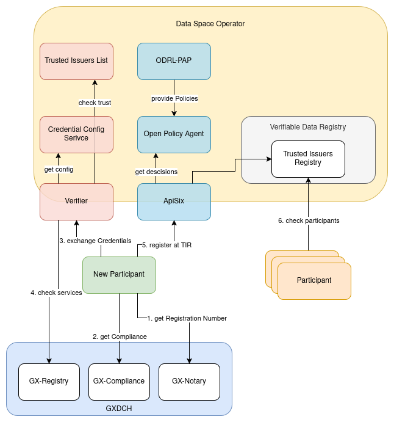

# Data Space On-Boarding with Gaia-X Credentials

Data Spaces more and more rely on Verifiable Credentials to build trust between the participants. They are used to identify organizations and individuals during exchange of data or usage of digital services. In order to trust the credentials, most Data Space concepts include the existence of a [Verifiable Data Registry](https://www.w3.org/TR/vc-data-model-2.0/#dfn-verifiable-data-registries). In order to become part of the Data Space, participants need to get included into that registry. While this could be done through a somewhat manual process, the hackathon aims to create an fully automated selfd on-boarding for new participants, based on the trustworthy information provided by the [Gaia-X Digital Clearing Houses](https://gaia-x.eu/services-deliverables/digital-clearing-house/). In order to do so, a Data Space Operator will be setup, using the IAM Components of the [FIWARE Data Space Connector](https://github.com/FIWARE/data-space-connector). 

## Important links

* FIWARE Data Space Connector: https://github.com/FIWARE/data-space-connector
* Gaia-X Wizard: https://wizard.lab.gaia-x.eu/
* Credentials-Config-Service API: https://github.com/FIWARE/credentials-config-service/blob/main/api/credentials-config-service.yaml
* ODRL-PAP API: https://github.com/wistefan/odrl-pap/blob/main/api/odrl.yaml
* Trusted-Issuers-List API: https://github.com/FIWARE/trusted-issuers-list/blob/main/api/trusted-issuers-list.yaml

## Architecture and request flow


The Data Space Operator consistes of 3 functional component-sets:

* Authentication - allows to authenticate with [Verifiabel Credentials](https://www.w3.org/TR/vc-data-model-2.0/) through [OpenID4VP](https://openid.net/specs/openid-4-verifiable-presentations-1_0.html) 
    * [Verifier](https://github.com/FIWARE/VCVerifier): verifies credentials and returns JWT
    * [Credentials Config Service](https://github.com/FIWARE/credentials-config-service): provides configuration of scopes and trust-anchors for the verifier
    * [Trusted Issuers List](https://github.com/FIWARE/trusted-issuers-list): allows local trust entries
* Authorization - allow access to APIs, based on policies and authorization information(e.g. the JWT's)
    * [ApiSix](https://apisix.apache.org/): Api Gateway to provide access and enforce policy decisions
    * [Open Policy Agent](https://www.openpolicyagent.org/): evaluate policies and decide about requests
    * [ODRL-PAP](https://github.com/wistefan/odrl-pap): Translate ODRL to Rego and provide the policies to OPA
* Verifiable Data Registry - provide the participants informations about the Data Space
    * [Trusted Issuers Registry](https://github.com/FIWARE/trusted-issuers-list): provide endpoint to check participants




An automated On-Boarding could use the following steps:

1. The new participant gets a registration number from the [GX-Notary Service](https://gitlab.com/gaia-x/lab/compliance/gaia-x-notary-registrationnumber)
2. Create  LegalParticipantCredential & TermsAndConditionsCredential and request compliance
3. Present the credentials(LegalParticipant & ComplianceCredential) to the Verifier
4. Verifier checks and then returns a JWT:
    * that the ComplianceCredential certifies the LegalParticipantCredential
    * the ComplianceCredential can be trusted
    * potential additional local checks
5. New Participant uses the returend JWT to request registration at the TIR through ApiSix
    * ApiSix checks JWT is signed by the Verifier
    * requests decision at OPA
    * OPA evaluates Policies provided be the ODRL-PAP with the information from the JWT
6. Participants can check the new participant at the Trusted Issuers Registry

## Tasks for the Hackathon

- [ ] create Credentials Set for On-Boarding(f.e. using the Wizard)
- [ ] extend mapping and rego to support Trusted Issuers List
- [ ] create Policies for automated decision about On-Boarding, f.e. based on
    * location of the organization
- [ ] verify ComplianceCredentials coming from a ComplianceService
- [ ] define proper JWT inclusions
- [ ] try self-onboarding and interaction

## Setup Hackathon Environment

The FIWARE Data Space Connector uses a microservice archictecture that is best suited to run in a Kuberentes cluster. To have local environment as a test setting, a k3s cluster with basic infrastructure can be created via:

```shell   
    mvn clean deploy
    export KUBECONFIG=$(pwd)/target/k3s.yaml
```

> :warning: The following steps to generate the CA and Trust Anchor certificates are already handled by the maven command.

### Generate Root CA

In order to test independently, a CA is required. The CA needs to be provided to our cluster, to allow the services to trust all derived certificates.

```shell
    ./ca/generate-ca.sh 
```

### Generate Certificates for Trust-Anchor

```shell
    ./participant-certs/generate-certs.sh --caConfigFolder ../ca/config --caOutputFolder ../ca/out --dns *.127.0.0.1.nip.io --dns verifier.127.0.0.1.nip.io
```

and update its k3s:

```shell
    ./participant-certs/update-k3s.sh
```

### Deploy the trust anchor

In addition to checking the public trusted service providers, a Data Space usually will run some Trust Anchor Service to provide lists of participants. In order to deploy the trust anchor, use:

```shell
    helm install trust-anchor data-space-connector/trust-anchor --version 0.2.0 -f ./trust-anchor/trust-anchor.yaml --namespace=trust-anchor
    watch kubectl get pods -n trust-anchor    
```

### Deploy IAM

The IAM components(Authorization and Authentication) can be deployed as following

```shell
    helm install on-boarding data-space-connector/data-space-connector --version 7.37.4 -f ./on-boarding/on-boarding.yaml --namespace=trust-anchor
    watch kubectl get pods -n trust-anchor
```

### Create a participant

If a demo participant shoud be used, certificates can be generated as following:

```shell
    ./participant-certs/generate-certs.sh \
        --caConfigFolder ../ca/config \
        --caOutputFolder ../ca/out  \
        --dns fancy-marketplace.biz \
        --
```

### Prepare service

To configure the credential-config service, the internal addresses should be used as following:

```shell
    kubectl port-forward <credential-config-service> 9090:8080 -n trust-anchor
```

```shell
curl -X 'POST' \
    'http://localhost:9090/service' \
    -H 'accept: */*' \
    -H 'Content-Type: application/json' \
    -d '{
            "id": "on-boarding",
            "defaultOidcScope": "default",
            "oidcScopes": {
                "default": [
                    {
                        "type": "gx:LegalParticipant",
                        "trustedParticipantsLists": 
                        [
                        ],
                        "trustedIssuersLists": [
                            "*"
                        ],
                        "holderVerification": {
                            "enabled": false
                        },
                        "requireCompliance": true,
                        "jwtInclusion": {
                            "enabled": true,
                            "fullInclusion": false,
                            "claimsToInclude": [
                                "credentialSubject.gx:headquarterAddress",
                                "credentialSubject.gx:legalAddress",
                                "credentialSubject.type",
                                "issuer"
                            ]
                        }
                    },
                    {
                        "type": "VerifiableCredential",
                        "trustedParticipantsLists": 
                        [
                        ],
                        "trustedIssuersLists": [
                            "*"
                        ],
                        "holderVerification": {
                            "enabled": false
                        },
                        "requireCompliance": false,
                        "jwtInclusion": {
                            "enabled": false
                        }
                    }
                ]
            }
        }'
```

## Request self-onboarding

Following calls can be used to self-onboard. The credentials have to be presented and the resulting JWT can be used for requesting registration.


### Present credentials

> :bulb: The following calls assume the environment running and that at least a LegalParticipantCredential and the corresponding ComplianceCredential are available in the [cred.json file](./cred.json)

Get token endpoint:
```shell
  export TOKEN_ENDPOINT=$(curl -s -X GET 'http://til.127.0.0.1.nip.io:8080/.well-known/openid-configuration' | jq -r '.token_endpoint'); echo $TOKEN_ENDPOINT
```

Create the Holder:
```shell
    docker run -v $(pwd)/holder:/cert quay.io/wi_stefan/did-helper:0.1.1   
    export HOLDER_DID=$(cat holder/did.json | jq '.id' -r); echo ${HOLDER_DID}
```

Create the [Verifiabel Presentation](https://www.w3.org/TR/vc-data-model-2.0/#verifiable-presentations):

```shell
    export VERIFIABLE_PRESENTATION="{
        \"@context\": [\"https://www.w3.org/2018/credentials/v1\"],
        \"type\": [\"VerifiablePresentation\"],
        \"verifiableCredential\": [
            $(cat ./cred.json)
        ],
        \"holder\": \"${HOLDER_DID}\"
    }"; echo ${VERIFIABLE_PRESENTATION}
```

Header:
```shell
    export JWT_HEADER=$(echo -n "{\"alg\":\"ES256\", \"typ\":\"JWT\", \"kid\":\"${HOLDER_DID}\"}"| base64 -w0 | sed s/\+/-/g | sed 's/\//_/g' | sed -E s/=+$//); echo Header: ${JWT_HEADER}
```

Payload:
```shell
    export PAYLOAD=$(echo -n "{\"iss\": \"${HOLDER_DID}\", \"sub\": \"${HOLDER_DID}\", \"vp\": ${VERIFIABLE_PRESENTATION}}" | base64 -w0 | sed s/\+/-/g |sed 's/\//_/g' |  sed -E s/=+$//); echo Payload: ${PAYLOAD};   
```

Signature:
```shell
  export SIGNATURE=$(echo -n "${JWT_HEADER}.${PAYLOAD}" | openssl dgst -sha256 -binary -sign holder/private-key.pem | base64 -w0 | sed s/\+/-/g | sed 's/\//_/g' | sed -E s/=+$//); echo Signature: ${SIGNATURE};     
```

Combine to the JWT:
```shell
  export JWT="${JWT_HEADER}.${PAYLOAD}.${SIGNATURE}"; echo The Token: ${JWT}
```

Present the token:
```shell
    export ACCESS_TOKEN=$(curl -s -X POST $TOKEN_ENDPOINT \
      --header 'Accept: */*' \
      --header 'Content-Type: application/x-www-form-urlencoded' \
      --data grant_type=vp_token \
      --data vp_token=${JWT} \
      --data scope=default | jq '.access_token' -r ); echo ${ACCESS_TOKEN}
```
### ODRL-PAP

In order to allow access with the generated token, the ODRL-Policies have to be created at the ODRL-PAP.

Get access to the API:
```shell
    kubectl port-forward <odrl-pap> 9090:8080 -n trust-anchor
```

Create the Policy:
```shell
curl -X 'POST' http://localhost:9090/policy \
    -H 'Content-Type: application/json' \
    -d '<THE_POLICY>' 
```

### Check TIR

Check all registered issuers:

```shell
    curl -X 'GET'  'http://tir.127.0.0.1.nip.io:8080/v4/issuers/' | jq .
```

### TIL Call

Try to register:

```shell
    curl -X 'POST' \
        'http://til.127.0.0.1.nip.io:8080/issuer' \
        -H 'accept: */*' \
        -H "Authorization: Bearer ${ACCESS_TOKEN}" \
        -H 'Content-Type: application/json' \
        -d '{
            "did": "did:web:wizard.lab.gaia-x.eu:api:credentials:2d37wbGvQzbAQ84yRouh2m2vBKkN8s5AfH9Q75HZRCUQmJW7yAVSNKzjJj6gcjE2mDNDUHCichXWdMH3S2c8AaDLm3kXmf5R8AZxwoAyBZnKjPnGMKkjyFNaUY4TAhUPjwpMNxSbnexGWDjGkuLasJhZVMn4MmhniBu7kjms4byVGmaULyexPMV2xafGuY1eoruczkqChZaSZEspQT3YepkJTVzB89kHLBksQxwpQANgNZEGoN9abrx9JeDNr3W7GRKD2UPhnceNoRTKuRn8qaEnqmwXKd6HxDd9TXZnXGnVMR74oXyAgK59QYJVRfy1Vh4Mchb7XgM2EmrVQC1B2LAWFF7AjXp31LN3kTuPJbRLcttxb4GP6qrC5AJfZkh4tCKLP2Dj21KnvDsDAd9GNqaZtMNLpMgBaGzbG56oy48PEFgfKXQk11g2uArY9Y1KZyRkYYa2yryXEYtfh2DxUam7ebB4v5GD8tzXHWYsqGswB5ycGFkR4XEw8CbRyPLPTgfjs3vDgZChN9xp1cMaFwDnbPivZv7QaiuCTLUD3SPF8r3oVucJfkmbdDAxFKeEBdsQNNSeuJVv2aMpuB1mcrgYfAdt6vvMWfwPJzG",
            "credentials": []
        }'
```